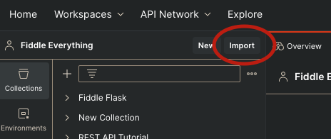
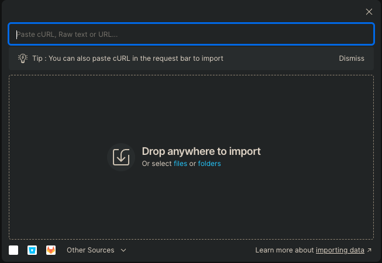
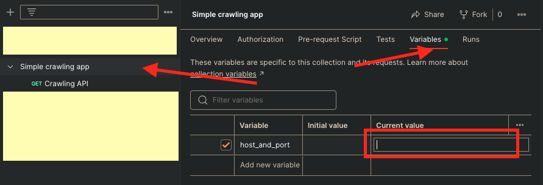
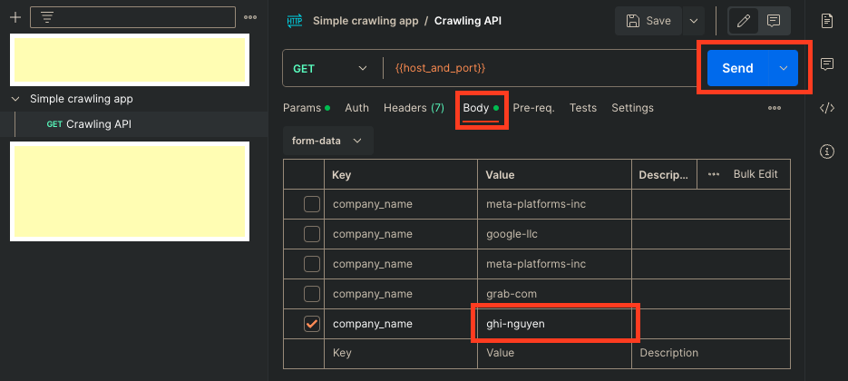

## Follow these steps for your manual tests:
1. Open the Postman app on your local machine or sign-in at https://identity.getpostman.com/login
2. Create a workspace or/and navigate to the relevant workspace.
3. Hit the "Import" button on the top left area of the browser's window. 
   
4. Drag the [postman.json file](postman.json) into the import modal.  
   
5. Navigate to the 'Simple crawling app', click on the 'Variables' tab to change the 'host_and_port' to the relevant host and port of the application at your end. For e.g: http://localhost:3333 
   
6. Navigate to the Body tab to modify your input and hit 'Send' to fire the request. Make sure the app is running on the 'host_and_port' above. 
   